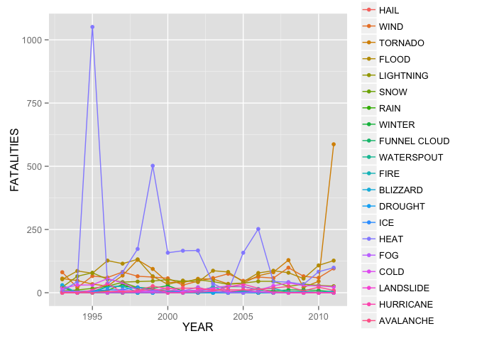

# Cumulative Damages of Adverse Weather Events between 1993 and 2011
Jonathan Stahlman  

### Synopsis

This analysis seeks to address two questions:

1. Across the United States, what types of weather events are most harmful with respect to population health?
2. Across the United States, what types of weather events have the greatest economic consequences?

We attempt to answer these questions by looking at the cumulative damages from 1993 until 2011 in terms of injuries, fatalities, property damage, and crop damage for many categories of adverse weather events. The five weather categories with the largest cumulative damages are reported for each of the four features.  In addition, time series plots are produced for the annual cumulative damage for each of the four features between 1993 and 2011.


### Data Processing


This analysis uses data taken from the [NOAA National Weather Service Storm Events Database](http://www.ncdc.noaa.gov/stormevents/) which maintains record of adverse weather events beginning in 1950.  The data document both the health and economic effects of these weather events in four "cost features" which are injuries, fatalities, property damage, and crop damage associated with each weather event.  These four features will be used to determine which weather types have the largest effect on the health and well-being of the population.


```r
if (!file.exists('./data')) dir.create('./data')
if (!file.exists('./data/StormData.csv.bz2')){
    fileUrl <- "https://d396qusza40orc.cloudfront.net/repdata%2Fdata%2FStormData.csv.bz2";
    download.file(fileUrl,destfile='./data/StormData.csv.bz2', method="curl");
}
data <- read.csv(bzfile('./data/StormData.csv.bz2'), nrows=-1)
data <- data[,c("EVTYPE","BGN_DATE","INJURIES","FATALITIES","PROPDMG","CROPDMG")]
```


The EVTYPE feature codifies the type of weather event for each observation, for which there are 985 different values in the raw data.  However, this feature requires cleaning before further analysis due to several issues:  
  1. **Duplicates**  Example: "TSTM WIND", "THUNDERSTORM WIND", and "THUNDERSTORM WINDS".  
  2. **Combos**  Example: "TSTM WIND", "HAIL", and "TSTM/HAIL".  
  3. **Subsets** Example: "FLOOD" and "URBAN FLOOD".    
In each of these examples, one would like to combine categories in order to capture a broad view of what weather types are making the largest impact.

An alternative strategy to categorizing the events is therefore developed in order to simplify the event types and analysis.  A simplified set of categories is proposed: HAIL, WIND, TORNADO, FLOOD, LIGHTNING, SNOW, RAIN, WINTER, FUNNEL CLOUD, WATERSPOUT, FIRE, BLIZZARD, DROUGHT, ICE, HEAT, FOG, COLD, LANDSLIDE, HURRICANE, and AVALANCHE.  An event is considered part of a category if its EVTYPE contains one of these keywords (this allows an event to be placed into multiple categories).  These keywords were chosen by hand after scanning the EVTYPE labels for which there were more than 500 entries over the entire dataset.  To make sure there is good coverage of the weather events, the fraction of uncategorized events (events not matching any of the above keywords) is also calculated.

The other cleaning that must be done is to make sure that there is consistent reporting of weather events over the entire period under consideration.  After looking through the data, there are zero entries for many of the weather categories before 1993, strongly indicating that weather events in those categories were not being reported during that time period.  To remove any effects of this, we only consider weather events between 1993 and 2011. 


```r
#remove data from before 1993
data$YEAR <- as.numeric(format(as.Date(as.character(data$BGN_DATE), format="%m/%d/%Y %H:%M:%S"),"%Y"))
data <- data[data$YEAR>=1993,]

props <- c("INJURIES","FATALITIES","PROPDMG","CROPDMG")
weather_keys = c("HAIL", "WIND", "TORNADO", "FLOOD", "LIGHTNING", "SNOW", "RAIN", "WINTER", "FUNNEL CLOUD", "WATERSPOUT", "FIRE", "BLIZZARD", "DROUGHT", "ICE", "HEAT", "FOG", "COLD", "LANDSLIDE", "HURRICANE", "AVALANCHE")

#add a column for each weather category
data$NCATS <- rep(0,dim(data)[1])
for (key in weather_keys){
  data[key] <- grepl(key, data$EVTYPE, ignore.case=TRUE)
  data$NCATS <- data$NCATS + data[key]
}
```

The total, mean, and median for all four of the cost features are reported for each weather event type.  Furthermore, an annual time series of these variables is also calculated in order to check if any time dependence is observed.  In particular, reporting of weather events may be sparse in the earliest years of the database, while later years should be more complete.  This is checked by studying the total number of weather events as a function of year.  Assuming no significant changes in climate over the past 60 years, large changes in the number of reported events can likely be ascribed to changes in reporting practices.


```r
#calculate sum of each column of interest for data which is categorized
sum_data  <- as.data.frame(t(sapply(weather_keys, 
                            function(x){ colSums(data[data[,x],c(x,props)])})))
colnames(sum_data)[1] <- "COUNT"

#calculate sum of each column of interest for data which is uncategorized
sum_other <- cbind(data.frame(COUNT=sum(data$NCATS==0)), 
                            t(colSums(data[data$NCATS==0,c(props)])))
row.names(sum_other)[1] <- "OTHER"

#combine the results
sum_data <- rbind(sum_data, sum_other)
```


```r
#calculate the sum of the features of interest grouped by event type and year
time_result <- data.frame(NAME=factor(),
                        YEAR=factor(),
                        COUNT=numeric(),
                        INJURIES=numeric(),
                        FATALITIES=numeric(),  
                        PROPDMG=numeric(),  
                        CROPDMG=numeric())

for (key in weather_keys){
  result <- aggregate(data[c(key,props)], by=data[c("YEAR",key)], sum) 
  colnames(result)[3]<- "COUNT"
  result <- result[result[,key],c("YEAR","COUNT",props)]
  result <- cbind(NAME=rep(key, dim(result)[1]),result) 
  time_result <- rbind(time_result, result)
}
time_result$NAME <- as.factor(time_result$NAME)
```


## Results

The data consist of 714738 recorded adverse weather events between 1993 and 2011.  In total, 68.8 thousand injuries and 10.9 thousand fatalities are reported as direct consequences of weather events.  The data also document 9.06 billion dollars in property damage and 1.38 billion dollars in crop damage. The fraction of events not matching one of the defined keywords is 0.015 and is small enough to be considered negligible.

The following tables give the five event categories with the largest health or economic impacts as measured by the appropriate feature.


```r
#sort the results
t_inj<-sum_data[order(sum_data$INJURIES, decreasing=TRUE),]
t_fat<-sum_data[order(sum_data$FATALITIES, decreasing=TRUE),]
t_pro<-sum_data[order(sum_data$PROPDMG, decreasing=TRUE),]
t_cro<-sum_data[order(sum_data$CROPDMG, decreasing=TRUE),]

#make a data frame which is easily converted to a table
output_data <- data.frame(Top5Injuries=row.names(t_inj)[1:5],
                          Injuries=t_inj[1:5,"INJURIES"],
                          Top5Fatalities=row.names(t_fat)[1:5],
                          Fatalities=t_fat[1:5,"FATALITIES"],
                          Top5PropertyDamage=row.names(t_pro)[1:5],
                          PropertyDamage=t_pro[1:5,"PROPDMG"],
                          Top5CropDamage=row.names(t_cro)[1:5],
                          CropDamage=t_cro[1:5,"CROPDMG"])
#print the table
kable(output_data, format='html')
```

<table>
 <thead>
  <tr>
   <th style="text-align:left;"> Top5Injuries </th>
   <th style="text-align:right;"> Injuries </th>
   <th style="text-align:left;"> Top5Fatalities </th>
   <th style="text-align:right;"> Fatalities </th>
   <th style="text-align:left;"> Top5PropertyDamage </th>
   <th style="text-align:right;"> PropertyDamage </th>
   <th style="text-align:left;"> Top5CropDamage </th>
   <th style="text-align:right;"> CropDamage </th>
  </tr>
 </thead>
<tbody>
  <tr>
   <td style="text-align:left;"> TORNADO </td>
   <td style="text-align:right;"> 23371 </td>
   <td style="text-align:left;"> HEAT </td>
   <td style="text-align:right;"> 3138 </td>
   <td style="text-align:left;"> WIND </td>
   <td style="text-align:right;"> 3134605.3 </td>
   <td style="text-align:left;"> HAIL </td>
   <td style="text-align:right;"> 585956.7 </td>
  </tr>
  <tr>
   <td style="text-align:left;"> HEAT </td>
   <td style="text-align:right;"> 9224 </td>
   <td style="text-align:left;"> TORNADO </td>
   <td style="text-align:right;"> 1649 </td>
   <td style="text-align:left;"> FLOOD </td>
   <td style="text-align:right;"> 2436131.5 </td>
   <td style="text-align:left;"> FLOOD </td>
   <td style="text-align:right;"> 364506.7 </td>
  </tr>
  <tr>
   <td style="text-align:left;"> FLOOD </td>
   <td style="text-align:right;"> 8604 </td>
   <td style="text-align:left;"> FLOOD </td>
   <td style="text-align:right;"> 1525 </td>
   <td style="text-align:left;"> TORNADO </td>
   <td style="text-align:right;"> 1391248.4 </td>
   <td style="text-align:left;"> WIND </td>
   <td style="text-align:right;"> 223939.8 </td>
  </tr>
  <tr>
   <td style="text-align:left;"> WIND </td>
   <td style="text-align:right;"> 8172 </td>
   <td style="text-align:left;"> WIND </td>
   <td style="text-align:right;"> 1188 </td>
   <td style="text-align:left;"> HAIL </td>
   <td style="text-align:right;"> 699320.4 </td>
   <td style="text-align:left;"> TORNADO </td>
   <td style="text-align:right;"> 100029.3 </td>
  </tr>
  <tr>
   <td style="text-align:left;"> LIGHTNING </td>
   <td style="text-align:right;"> 5232 </td>
   <td style="text-align:left;"> OTHER </td>
   <td style="text-align:right;"> 1033 </td>
   <td style="text-align:left;"> LIGHTNING </td>
   <td style="text-align:right;"> 603710.3 </td>
   <td style="text-align:left;"> DROUGHT </td>
   <td style="text-align:right;"> 33954.4 </td>
  </tr>
</tbody>
</table>


This set of plots shows the total sum of the four features of interest as a function of year between 1993 and 2011.  


```r
#now make plots
ggplot(time_result, aes(YEAR,INJURIES,color=NAME)) + 
            geom_point() + 
            geom_line(aes(group=NAME))
```

 

```r
ggplot(time_result, aes(YEAR,FATALITIES,color=NAME)) + 
            geom_point() + 
            geom_line(aes(group=NAME))
```

 

```r
ggplot(time_result, aes(YEAR,PROPDMG,color=NAME)) + 
            geom_point() + 
            geom_line(aes(group=NAME))
```

 

```r
ggplot(time_result, aes(YEAR,CROPDMG,color=NAME)) + 
            geom_point() + 
            geom_line(aes(group=NAME))
```

 

### Appendix

The full table of numbers for all categories in decreasing order according to the number of incidents is shown here.


```r
kable(sum_data[order(sum_data$COUNT, decreasing=TRUE),])
```

                 COUNT   INJURIES   FATALITIES      PROPDMG     CROPDMG
-------------  -------  ---------  -----------  -----------  ----------
WIND            273938       8172         1188   3134605.26   223939.84
HAIL            228569       1066           40    699320.38   585956.66
FLOOD            82731       8604         1525   2436131.51   364506.73
TORNADO          25936      23371         1649   1391248.44   100029.27
WINTER           19604       1891          278    151188.99     2498.99
SNOW             17705       1166          169    152552.63     2195.72
LIGHTNING        15776       5232          817    603710.28     3585.61
RAIN             12241        305          114     59426.21    12923.10
OTHER            10477       2382         1033    132982.08    23431.98
FUNNEL CLOUD      6935          3            0       194.60        0.00
FIRE              4240       1608           90    125223.29     9565.74
WATERSPOUT        3861         72            6     10780.70        0.00
BLIZZARD          2745        806          101     26023.48      172.00
HEAT              2648       9224         3138      3232.86     1473.18
DROUGHT           2512         19            6      4299.05    33954.40
COLD              2463        320          451     15171.09     8934.79
ICE               2195       2166          102     76353.02     1694.75
FOG               1883       1077           81     17259.26        0.00
LANDSLIDE          613         53           39     19117.94       37.00
AVALANCHE          387        171          224      1628.90        0.00
HURRICANE          288       1328          135     23757.25    10812.79
